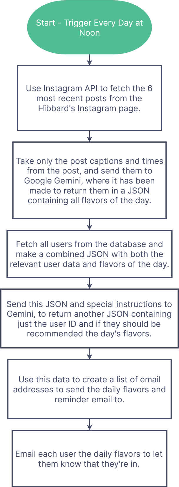

# Hibbard's Custard Notifier App

**Satisfy your sweet tooth with real-time updates on your favorite custard flavors!** Developed by the ingenious Luke Merletti, this webapp is your go-to source for all things deliciously Hibbard's. Check it out live and get your custard fix at [hibbards-custard-alerter.vercel.app](https://hibbards-custard-alerter.vercel.app/).

## How it Works

Tired of missing out on your favorite Hibbard's Custard flavors? Only want to be tempted when there's a flavor you're interested in? Our app keeps tabs on Hibbard's Instagram page, ensuring you're the first to know when a flavor you might be interested in is available.

## What Data is Stored and Collected?

Your privacy is with this app is a priority. I only collect your email address, and your password. Rest assured, your password remains encrypted, and no other data is collected from you.

## How to Contribute?

Got an idea to make this app even sweeter? Fork the repo, make your changes, and submit a pull request. I'll review it promptly, and if it's there are no issues, I'll merge it in!

## Contact

Got questions or suggestions about the app? Don't hesitate to reach out at [hibbardscustardnotifier@gmail.com](mailto:hibbardscustardnotifier@gmail.com).
